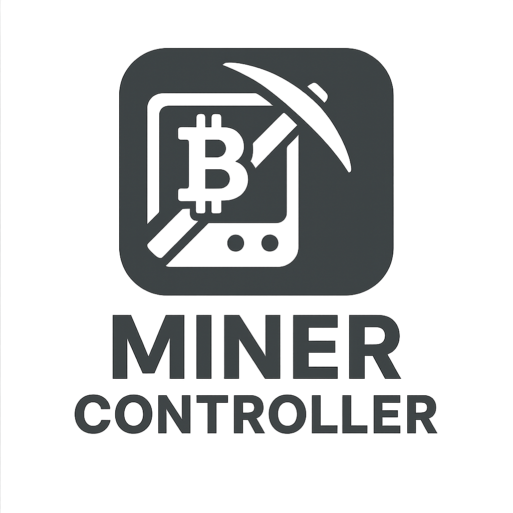

# 🔥 MinerControl Android

> **Real-time monitoring of your solo lottery miners**

A modern Android application for monitoring and managing cryptocurrency miners in real-time via UDP protocol. Built with Kotlin and Jetpack Compose for a seamless native Android experience.



## ✨ Features

### 📊 **Real-time Dashboard**
- **Live mining statistics** with beautiful circular gauges
- **Total hashrate monitoring** with automatic unit scaling (KH/s → GH/s → TH/s)
- **Temperature monitoring** with color-coded alerts
- **Power consumption tracking**
- **Online/offline status** for all miners

### 🎛️ **Advanced Miner Management**
- **Custom miner naming** with persistent storage
- **Automatic network discovery** on current WiFi network
- **UDP listener** on configurable port (default: 12345)
- **Detailed miner information** including uptime, shares, and difficulty

### 🌐 **Multi-language Support**
- **Portuguese** and **English** interfaces
- **Dynamic language switching** without app restart
- **Localized number formatting** and messages

### ⚙️ **Customizable Settings**
- **Personalized app name** in dashboard header
- **Network configuration** with current WiFi detection
- **UDP port configuration** for different setups
- **Persistent preferences** storage

### 📱 **Optimized for Modern Phones**
- **Full notch/cutout support** - no black spaces on sides
- **Responsive layout** that uses all available screen space
- **Landscape orientation** optimized for mining dashboards

## 🚀 Quick Start

### Prerequisites
- Android 7.0+ (API level 24+)
- WiFi connection to same network as miners
- Miners sending UDP JSON packets on port 12345

### Installation
1. Download the latest APK from [Releases](../../releases)
2. Enable "Install from unknown sources" on your Android device
3. Install the APK file
4. Grant network permissions when prompted

### First Setup
1. **Connect** your Android device to the same WiFi network as your miners
2. **Open** MinerControl app
3. **Go to Settings** ⚙️ to configure:
   - App name (appears in dashboard header)
   - Language preference (PT/EN)
   - UDP port (default: 12345)
4. **Return to dashboard** to see your miners automatically discovered

### 📱 Notch/Cutout Support
This application is optimized for modern phones with notch or cutout:
- **Full screen utilization** without black side spaces
- **Adaptive layout** that adjusts to different screen formats
- **Native support** for Android 9+ with `shortEdges` configuration

## 📡 Miner Protocol

MinerControl expects miners to send UDP JSON packets with the following structure:

```json
{
  "IP": "192.168.1.100",
  "Name": "Miner-01",
  "HashRate": "389.6K",
  "Temp": 52.0,
  "Power": 145.0,
  "Uptime": "002d 14:32:18",
  "Share": "45/2",
  "PoolDiff": "1024",
  "Valid": 43,
  "PoolInUse": "solo.example.com:3333"
}
```

### Supported Fields
| Field | Type | Description | Example |
|-------|------|-------------|---------|
| `IP` | String | Miner IP address | `"192.168.1.100"` |
| `Name` | String | Miner identifier | `"Miner-01"` |
| `HashRate` | String | Hash rate with unit | `"389.6K"`, `"1.2M"`, `"0.5G"` |
| `Temp` | Number | Temperature in °C | `52.0` |
| `Power` | Number | Power consumption in watts | `145.0` |
| `Uptime` | String | Runtime duration | `"002d 14:32:18"` |
| `Share` | String | Accepted/Rejected shares | `"45/2"` |
| `PoolDiff` | String | Pool difficulty | `"1024"` |
| `Valid` | Number | Valid blocks found | `43` |
| `PoolInUse` | String | Current mining pool | `"solo.example.com:3333"` |

## 🏗️ Architecture

### Tech Stack
- **Kotlin** - Modern Android development language
- **Jetpack Compose** - Declarative UI framework
- **Material 3** - Latest Material Design components
- **DataStore** - Preferences and settings storage
- **Coroutines & Flow** - Reactive programming and concurrency
- **GSON** - JSON serialization/deserialization
- **UDP Sockets** - Network communication with miners

### Project Structure
```
app/src/main/kotlin/com/minercontrol/app/
├── model/
│   ├── Miner.kt              # Miner data model
│   ├── IncomingMinerPayload.kt # UDP JSON parsing
│   └── SettingsRepository.kt  # Persistent settings
├── network/
│   ├── UdpListener.kt        # UDP packet receiver
│   └── NetworkScanner.kt     # WiFi network detection
├── ui/
│   ├── components/           # Reusable UI components
│   ├── screens/             # Dashboard & Settings screens
│   └── theme/               # Material 3 theming
├── utils/
│   └── LanguageManager.kt   # Localization system
└── navigation/
    └── MinerControlNavigation.kt # Navigation graph
```

## 🔧 Development

### Build Requirements
- **Android Studio** Arctic Fox or newer
- **JDK 11+**
- **Android SDK** with API level 34+
- **Gradle 8.0+**

### Building from Source
```bash
# Clone the repository
git clone https://github.com/Prismas33/minercontroll.git
cd minercontroll

# Build debug APK
./gradlew assembleDebug

# Install to connected device
./gradlew installDebug

# Run tests
./gradlew test
```

### Development Setup
1. **Open project** in Android Studio
2. **Sync Gradle** dependencies
3. **Connect Android device** or start emulator
4. **Run configuration** is already set up for main activity

## 📱 Screenshots

| Dashboard | Settings | Miner Details |
|-----------|----------|---------------|
|  |  |  |

## 🛠️ Configuration

### Network Setup
- Ensure Android device and miners are on **same WiFi network**
- Configure router to allow **UDP broadcast** on port 12345
- Check firewall settings if miners not appearing

### Troubleshooting
- **No miners found**: Check UDP port configuration and network connectivity
- **Wrong hashrate units**: Verify miner sends hashrate in expected format
- **Temperature alerts**: Adjust thresholds in miner firmware if needed
- **Black spaces on screen**: The app already has notch/cutout support enabled automatically

### Known Issues
- On some older devices, app restart may be needed after orientation change
- UDP discovery works best on home networks (may have limitations on enterprise networks)

## 🤝 Contributing

Contributions are welcome! Please read our [Contributing Guide](CONTRIBUTING.md) for details on our code of conduct and the process for submitting pull requests.

### Development Workflow
1. **Fork** the repository
2. **Create** feature branch (`git checkout -b feature/amazing-feature`)
3. **Commit** your changes (`git commit -m 'Add amazing feature'`)
4. **Push** to branch (`git push origin feature/amazing-feature`)
5. **Open** Pull Request

## � License

This project is licensed under the MIT License - see the [LICENSE](LICENSE) file for details.

## 🙏 Acknowledgments

- **Material Design** team for the beautiful design system
- **Jetpack Compose** team for the modern UI framework
- **Kotlin** team for the amazing programming language
- Mining community for feedback and testing

## 📞 Support

- **Issues**: [GitHub Issues](../../issues)
- **Discussions**: [GitHub Discussions](../../discussions)
- **Email**: [prismas33@example.com](mailto:prismas33@example.com)

---

<div align="center">

**Made with ❤️ for the mining community**

**© 2025 Prismas33 - Licensed under MIT License**

[⬆ Back to top](#-minercontrol-android)

</div>
